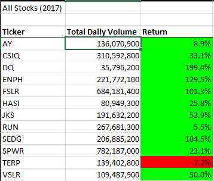
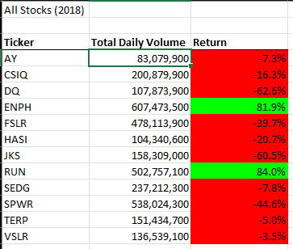
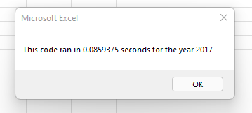
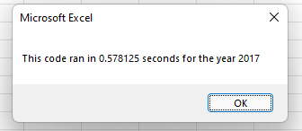
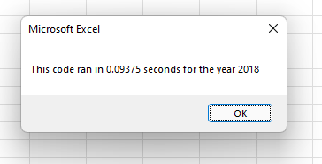
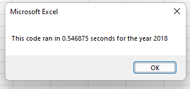

# Stocks Analysis using VBA

## Overview of Project
In this project, I refactored code to make it more efficient to run macros on stock data as well as compared the data year by year.

## Results
In result of this analysis I discovered that most of the stocks performed poorly as compared to 2017.

Only two stocks gave returns during the year 2018 and those stocks were on top in terms of total daily volume traded that year.

My refactored code ran 5 times faster than the original code.

### Summary of Analysis
Some of the advantages of refactoring code is that you can make the code more simple and easy for others to read, it can help save time in the future, and it can make the code easier to maintain. More often then not you won't be the only person using the code you're creating. So, if you make the code more simple for others to read and modify, this saves time as well as money for what would be spent on the development team making changes to the code. One disadvantage to refactoring code is that there is a possibility that the developer changing the code could break the code in the process which would end up costing time and money. In this case of my own refactoring of code, although I ran into a few issues, I believe the trade off of the time/memory saved running the refactored macro paid off with how much more efficient the code is.

